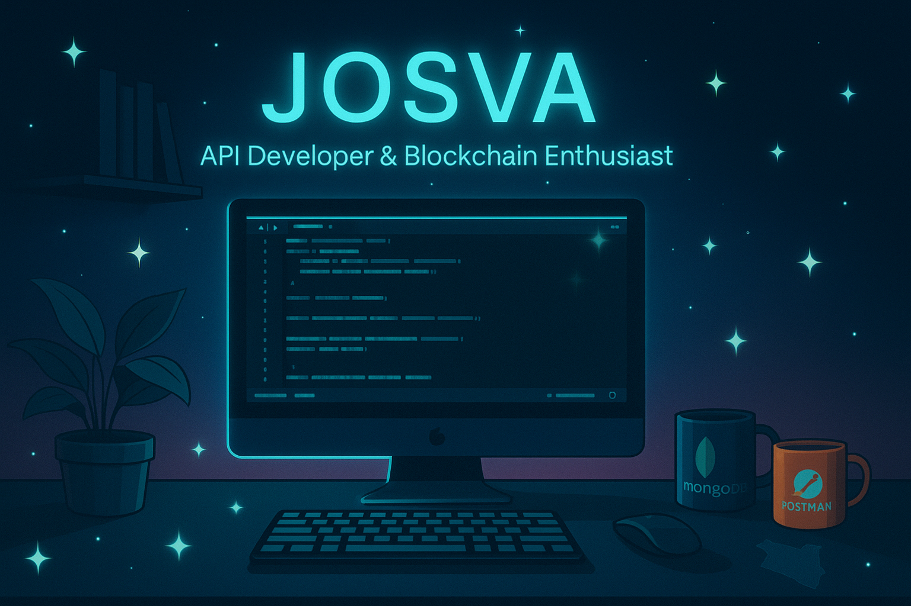

  

<h1 align="center">Hi 👋, I'm Josva</h1>
<h3 align="center">Full stack Developer • Blockchain Enthusiast • Civic‑Tech Innovator</h3>

  🚀 I build APIs and systems that drive transparency, governance, healthcare, and affordable housing in <strong>Kenya</strong>.

---

## 🛠 Tech Stack

  &nbsp;
  &nbsp;
  &nbsp;
  &nbsp;
  &nbsp;
  &nbsp;
  

---

## 💡 Projects to Explore

### 🟢 [AffordableHousingLedger](https://github.com/josva12/AffordableHousingLedger)  
A blockchain-based housing registry for transparency in Kenya’s affordable housing sector.

### 🟣 [MedBlock](https://github.com/josva12/MedBlock) *(coming soon)*  
Role-based EHR platform with AI diagnostics and blockchain validation tailored for Kenyan healthcare.

### 🔵 [EthicalTraceChain](https://github.com/josva12/EthicalTraceChain)  
An API-driven, blockchain-powered supply-chain system promoting ethical sourcing—from farm to shop.

### 🔷 [PaymentApi](https://github.com/josva12/PaymentApi)  
A secure, extensible TypeScript API for handling payment transactions with best practices.

### 📘 [My-Data-Science-Journey](https://github.com/josva12/My-Data-Science-Journey)  
A curated log of my data science learning path—exploring Jupyter, Python, stats, and ML.

---

## 👨‍💻 About Me

- 🌍 Kenyan technologist passionate about ethical tech and public good  
- 🧠 Focusing on **healthcare**, **housing**, **ethical supply chains**, and **API-first design**  
- 🔗 Advocate for **transparency**, **equity**, and **open-source systems**

---

## 📫 Connect With Me

  &nbsp;
  &nbsp;
  &nbsp;
  

---

## 📊 GitHub Stats

   
  

---

  🌍 <em>“Code should empower people, not just users.”</em>

